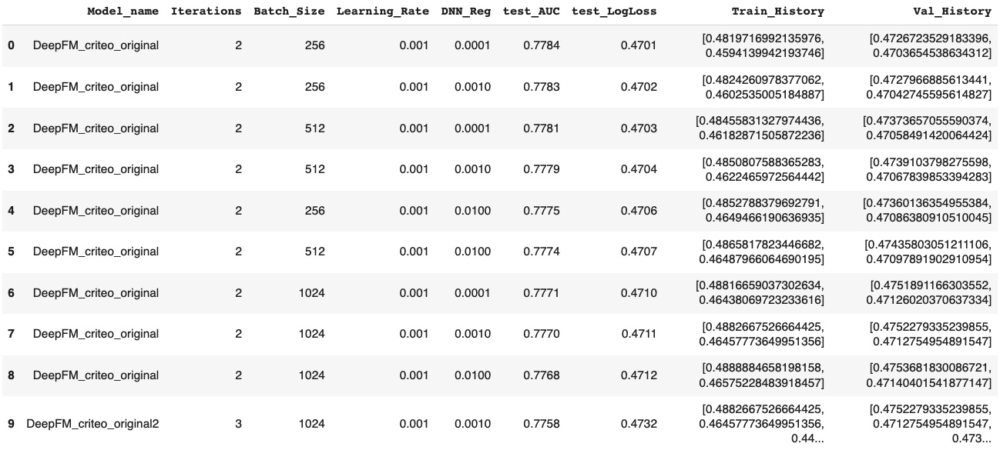

# final project for the Recommendation Systemscourse, IDC, 2022

## Getting started

1. First, clone DeepCTR-Torch package into google colab notebook

```
git clone https://github.com/shenweichen/DeepCTR-Torch.git
```

2. Clone also Our repo with the modification of models and layers folders

```
git clone https://github.com/rotem-benzvi/finalproject_xdeepFM.git
```

3. Copy the **DeepCTR-Torch folder** into google Drive and replace both models and layers folders with ours folders.

## Load and Prepare datasets

In this project we choose two datasets: Criteo and Avazu.
After cloning our repo, copy the relevant notebook into google Drive - [Criteo notebook](https://github.com/rotem-benzvi/finalproject_xdeepFM/blob/e087b34f7216fe6c9a636b125c60e7147e7865b1/RCSYS%20-%20criteo%20original%20dataset.ipynb) , [Avazu notebook](https://github.com/rotem-benzvi/finalproject_xdeepFM/blob/e087b34f7216fe6c9a636b125c60e7147e7865b1/RCSYS-%20avazu%20dataset.ipynb).

Important notice:

- Google colab pro with High-RAM is must for running both notebooks.
- The datasets files are very big, therefore to avoid crashing we use Dask and split the dataset before we prepare it and at the end we merge the files.

Finally, after follow the instruction in dataset notebooks and running we will get the following files (in this example for avazu dataset):

avazu_train.pkl
<br>
avazu_test.pkl
<br>
dnn_feature_columns_avazu.p
<br>
linear_feature_columns_avazu
<br>
feature_names_avazu
<br>

Save those files in google drive.

## Training and Evalutaion

In our [final project notebook](https://github.com/rotem-benzvi/finalproject_xdeepFM/blob/8f7e5d1331346e1764b0aead6dcc5d29ac7eae14/RCSYS%20-%20final%20project.ipynb) we use **DeepCTR-Torch folder**, load the dataset files we create and then we train and evaluate our models. All the results dataframes saved in **results folder**.

## Results

We use [figures&plots notebook](https://github.com/rotem-benzvi/finalproject_xdeepFM/blob/8da77fced13de7f3c107ee00dcf4a08a5e76b2c1/figures&plots.ipynb) to display all the different results (models and datasets) and find the best Hyperparameters.
In addition, thisnotebook include functions to plot all the train and validation losses history per model and dataset.

All the results dataframes saved in results folder as pickle files, for example all the expirements of DeepFM model on criteo Dataset saved in results/final_results_DeepFM_criteo_original.pkl. Using [figures&plots notebook](https://github.com/rotem-benzvi/finalproject_xdeepFM/blob/8da77fced13de7f3c107ee00dcf4a08a5e76b2c1/figures&plots.ipynb) we can explore the results -

<div align="center">



</div>

Including figures of train and validation losses.
